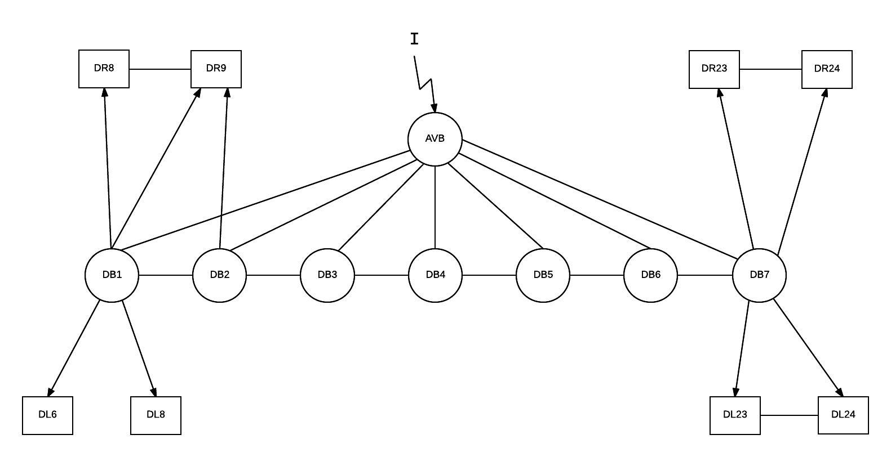
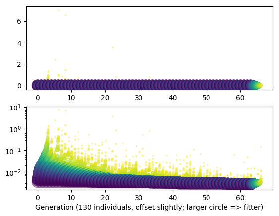
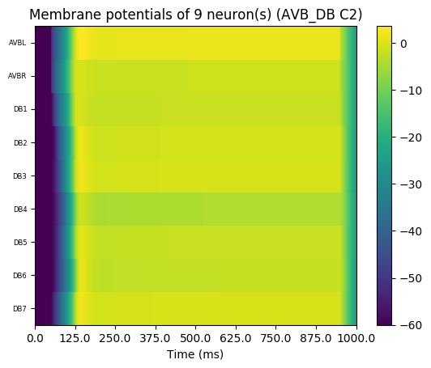
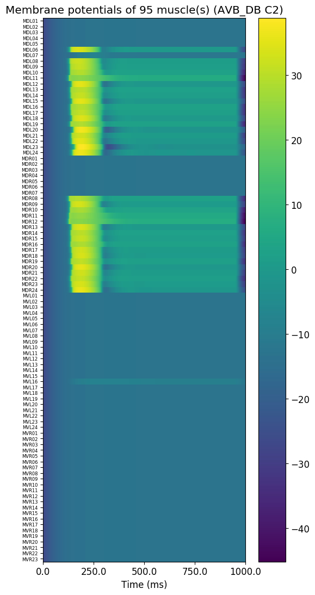

# Network:

### Cells to simulate:

- Command neurons: AVBL, AVBR
- Motor neurons: DB1, DB2, DB3, DB4, DB5, DB6, DB7
- Muscles: DL(6,8-24), DR(8-24)

### Connections:

- Gap-junctions:
    - DB1 - DB2, DB2 - DB3, ..., DB6 - DB7
    - muscle - muscle 
- Delayed gap-junctions:
    - AVB(L/R) - DB(1-7) (no connection from AVBL to DB1)
- Chemical synapses:
    - DB - muscle

# Simulation:

- duration: 1000 ms
- dt: 0.05
- Injected current:
    - Target: AVB(L/R)
    - Current: 15 pA
    - Time: 50 ms <= t < 900 ms

# Optimization:

### Parameters to optimize

- conductance, sigma, mu, of the delayed gap-junctions
- conductance of the chemical-synapses.

### Ranges

- AVB - DB
    - conductance: [0.00052, 0.06252] nS
    - sigma: [0.1, 0.9] per_mV
    - mu: [-70, 20] mV 
- DB1 - DB2, ..., DB6 - DB7
    - conductance: [0.00002, 0.04252] nS
- DB - muscle
    - conductance: [0.02, 2] nS
- muscle - muscle
    - conductance: [0.00002, 0.00050] nS

### Targets of the optimization:

- 'first spike time' of DB motor neurons (spike time is depending on the spike theshold of -20 mV).
    - DB1 at t=115 ms
    - DB2 at t=125 ms
    - DB3 at t=135 ms
    - DB4 at t=145 ms
    - DB5 at t=155 ms
    - DB6 at t=165 ms
    - DB7 at t=175 ms

# Results

