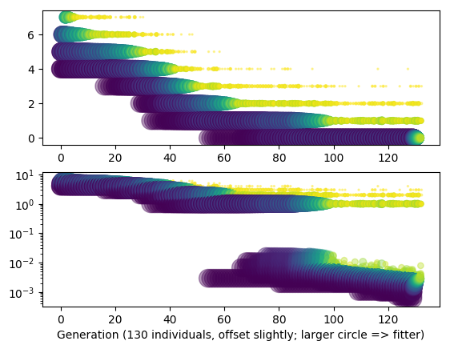
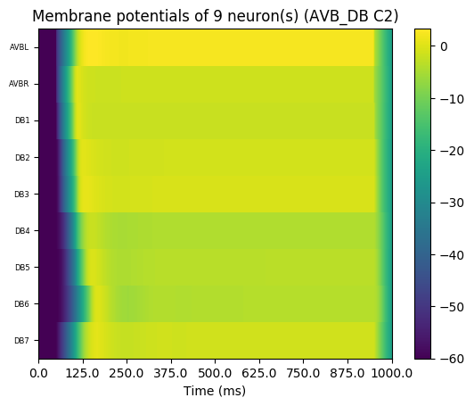
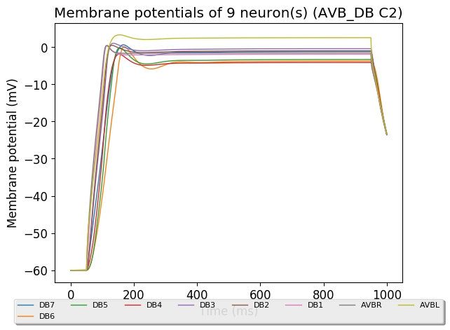
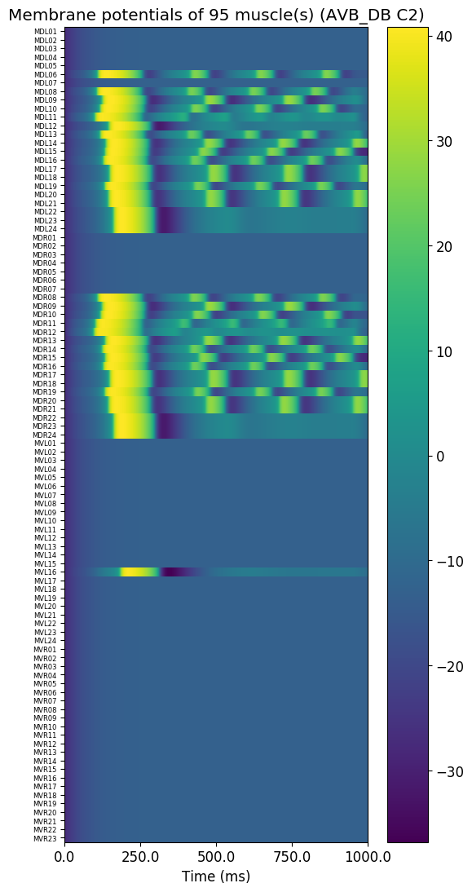
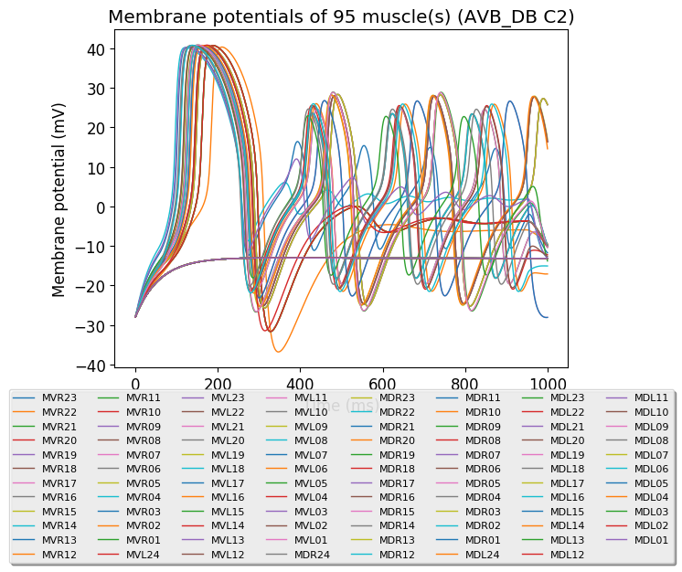

# Network:

### Neural Circuit:

- Command neurons: AVBL, AVBR
- Motor neurons: DB1, DB2, DB3, DB4, DB5, DB6, DB7
- Muscles: DL(6,8-24), DR(8-24)

### Connections:

- Gap-junctions:
    - AVBL - AVBR
    - DB1 - DB2, DB2 - DB3, ..., DB6 - DB7
    - muscle - muscle 
- Delayed gap-junctions:
    - AVB(L/R) - DB(1-7) (no connection between AVBL - DB1)
- Chemical synapses:
    - AVBL - AVBR, AVBR - AVBL
    - DB - muscle

# Simulation Setup:

- duration: 1000 ms
- dt: 0.05
- Injected current:
    - Target: AVB(L/R)
    - Current: 15 pA
    - Time: 50 ms <= t < 900 ms

# Optimization:

### Parameters for the genetic algorithm:

- Population size: 130
- Selection size / offspring size: 30
- Mutation rate: 0.1
- Termination conditions:
    - Maximal number of evaluations: 4000

### Parameters to optimize

- conductance of chemical synapses.
    - DB - muscle
- conductance of gap-junctions.
    - muscle - muscle

# TODO: CHANGE following !!

### Ranges

- AVB - DB
    - conductance: [0.00052, 0.06252] nS
    - sigma: [0.01, 0.9] per_mV
    - mu: [-90, 40] mV 
- DB1 - DB2, ..., DB6 - DB7
    - conductance: [0.00002, 0.04252] nS

### Targets of the optimization:

- 'first spike time' of DB motor neurons (spike time is depending on the spike theshold of -20 mV).
    - DB1 at t=115 ms
    - DB2 at t=125 ms
    - DB3 at t=135 ms
    - DB4 at t=145 ms
    - DB5 at t=155 ms
    - DB6 at t=165 ms
    - DB7 at t=175 ms

### Weights of the targets:

- DB1 first spike time: 5
- DB2-DB7 first spike time: 1

# Results

- 'DB1/0/GenericNeuronCell/v:first_spike_time': 115.55,
- 'DB2/0/GenericNeuronCell/v:first_spike_time': 130.6,
- 'DB3/0/GenericNeuronCell/v:first_spike_time': 135.05,
- 'DB4/0/GenericNeuronCell/v:first_spike_time': 153.25,
- 'DB5/0/GenericNeuronCell/v:first_spike_time': 155.4,
- 'DB6/0/GenericNeuronCell/v:first_spike_time': 169.95,
- 'DB7/0/GenericNeuronCell/v:first_spike_time': 166.55

All the parameters for the best individual can be found inside the nml file at [CASE1AVB_DB.nml](CASE2AVB_DB.nml).

To rerun the simulation for the best individual execute `pynml LEMS_CASE2AVB_DB.xml`.

# Conclusion

Due to the huge number of parameters and the corresponding ranges, the optimizer didn't find a good solution for the given number of max evaluations.
