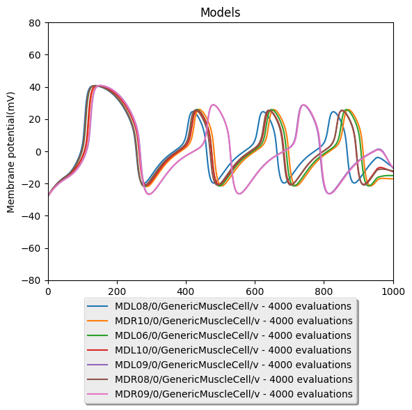

# Network:

### Neural Circuit:

- Command neurons: AVBL, AVBR
- Motor neurons: DB1, DB2, DB3, DB4, DB5, DB6, DB7
- Muscles: DL(6,8-24), DR(8-24)

### Connections:

- Gap-junctions:
    - AVBL - AVBR
    - DB1 - DB2, DB2 - DB3, ..., DB6 - DB7
    - muscle - muscle 
- Delayed gap-junctions:
    - AVB(L/R) - DB(1-7) (no connection between AVBL - DB1)
- Chemical synapses:
    - AVBL - AVBR, AVBR - AVBL
    - DB - muscle

# Simulation Setup:

- duration: 1000 ms
- dt: 0.05
- Injected current:
    - Target: AVB(L/R)
    - Current: 15 pA
    - Time: 50 ms <= t < 900 ms

# Optimization:

### Parameters for the genetic algorithm:

- Population size: 130
- Selection size / offspring size: 30
- Mutation rate: 0.1
- Termination conditions:
    - Maximal number of evaluations: 6000

### Parameters to optimize

- conductance of chemical synapses.
    - DB1 - MDL06, MDL08, MDL09, MDR08, MDR09
    - DB2 - MDL09, MDL10, MDR09, MDR10

### Ranges

- DB - muscle
    - conductance: [0.02, 2] nS

### Targets of the optimization:

- 'mean spike frequency' of muscle cells (spike is depending on the spike theshold of -10 mV).
    - spike frequency for MDL(6,8,9,10) and MDR(8, 9, 10): 4.0

### Weights of the targets:

- every target has the same weight of 1

# Results

- 'MDL06/0/GenericMuscleCell/v:mean_spike_frequency': 4.077194889915738
- 'MDL08/0/GenericMuscleCell/v:mean_spike_frequency': 4.0106951871657754
- 'MDL09/0/GenericMuscleCell/v:mean_spike_frequency': 3.9617035325189831
- 'MDL10/0/GenericMuscleCell/v:mean_spike_frequency': 3.9596119580281135
- 'MDR08/0/GenericMuscleCell/v:mean_spike_frequency': 4.1014423405564289
- 'MDR09/0/GenericMuscleCell/v:mean_spike_frequency': 3.9898922729086315
- 'MDR10/0/GenericMuscleCell/v:mean_spike_frequency': 4.032258064516129

All the parameters for the best individual can be found inside the nml file at [CASE1AVB_DB.nml](CASE2AVB_DB.nml).

To rerun the simulation for the best individual execute `pynml LEMS_CASE2AVB_DB.xml`.

# Conclusion

Due to the huge number of parameters and the corresponding ranges, the optimizer didn't find a good solution for the given number of max evaluations.
