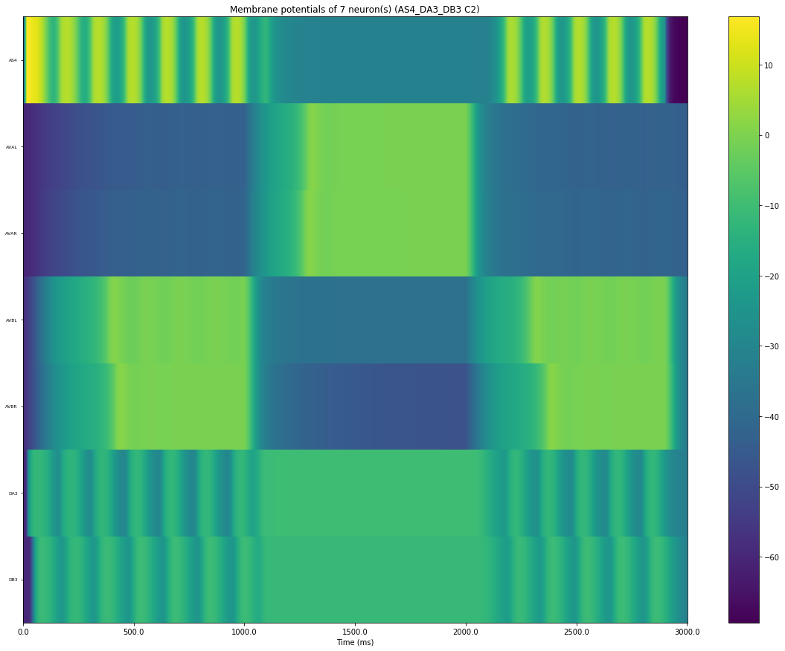
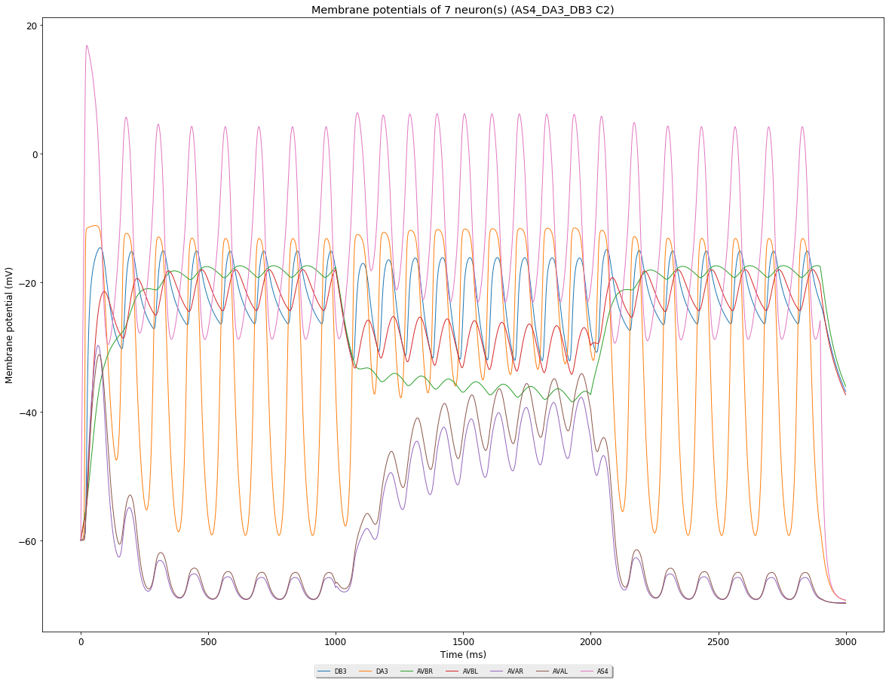
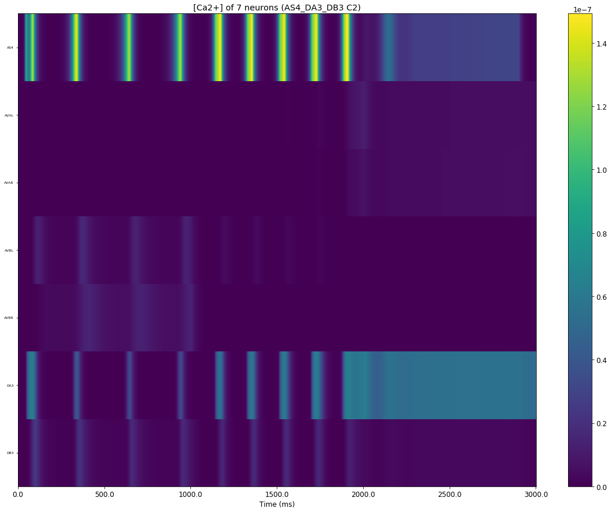
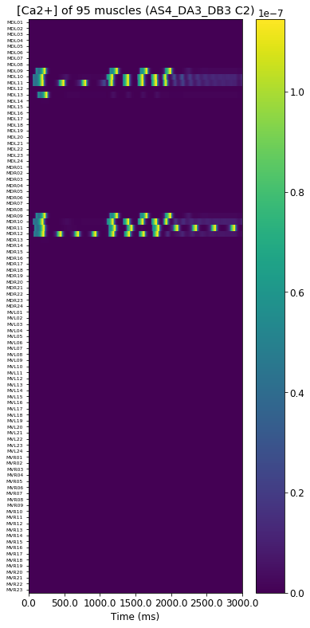

| Id | Neurons (membrane) | Neurons (membrane) | Muscles (membrane) | Muscles (membrane) | Neurons (activity) | Neurons (activity) | Muscles (activity) | Muscles (activity) |
| :---         |     :---:      |     :---:     |     :---:     |     :---:     |     :---:     |     :---:     |     :---:     |     :---:     |
| [case60](AS4-DA3-DB3_case60) |  |  | | |  |  | |
| [case59](AS4-DA3-DB3_case59) |  |  | | |  |  | |
| [case58](AS4-DA3-DB3_case58) |  |  | | |  |  | |
| [case57](AS4-DA3-DB3_case57) |  |  | | |  |  | |
| [case56](AS4-DA3-DB3_case56) |  |  | | |  |  | |
| [case55](AS4-DA3-DB3_case55) |  |  | | |  |  | |
| [case54](AS4-DA3-DB3_case54) |  |  | | |  |  | |
| [case53](AS4-DA3-DB3_case53) |  |  | | |  |  | |
| [case52](AS4-DA3-DB3_case52) |  |  | | |  |  | |
| [case51](AS4-DA3-DB3_case51) |  |  | | |  |  | |
| [case50](AS4-DA3-DB3_case50) |  |  |  |  |  |  |  |  |
| [case49](AS4-DA3-DB3_case49) |  |  |  |  |  |  |  |  |
| [case48](AS4-DA3-DB3_case48) |  |  |  |  |  |  |  |  |
| [case47](AS4-DA3-DB3_case47) |  |  |  |  |  |  |  |  |
| [case46](AS4-DA3-DB3_case46) |  |  |  |  |  |  |  |  |
| [case45](AS4-DA3-DB3_case45) |  |  |  |  |  |  |  |  |
| [case44](AS4-DA3-DB3_case44) |  |  |  |  |  |  |  |  |
| [case43](AS4-DA3-DB3_case43) |  |  |  |  |  |  |  |  |
| [case42](AS4-DA3-DB3_case42) |  |  |  |  |  |  |  |  |
| [case41](AS4-DA3-DB3_case41) |  |  |  |  |  |  |  |  |
| [case40](AS4-DA3-DB3_case40) |  |  |  |  |  |  |  |  |
| [case39](AS4-DA3-DB3_case39) |  |  |  |  |  |  |  |  |
| [case38](AS4-DA3-DB3_case38) |  |  |  |  |  |  |  |  |
| [case37](AS4-DA3-DB3_case37) |  |  |  |  |  |  |  |  |
| [case36](AS4-DA3-DB3_case36) |  |  |  |  |  |  |  |  |
| [case35](AS4-DA3-DB3_case35) |  |  |  |  |  |  |  |  |
| [case34](AS4-DA3-DB3_case34) |  |  |  |  |  |  |  |  |
| [case33](AS4-DA3-DB3_case33) |  |  |  |  |  |  |  |  |
| [case32](AS4-DA3-DB3_case32) |  |  |  |  |  |  |  |  |
| [case31](AS4-DA3-DB3_case31) |  |  |  |  |  |  |  |  |

