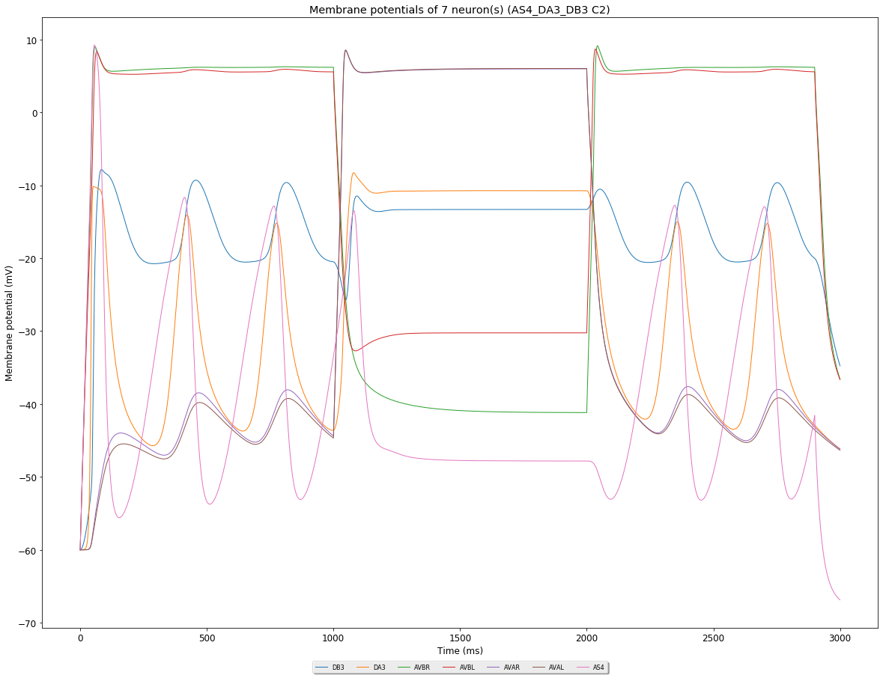
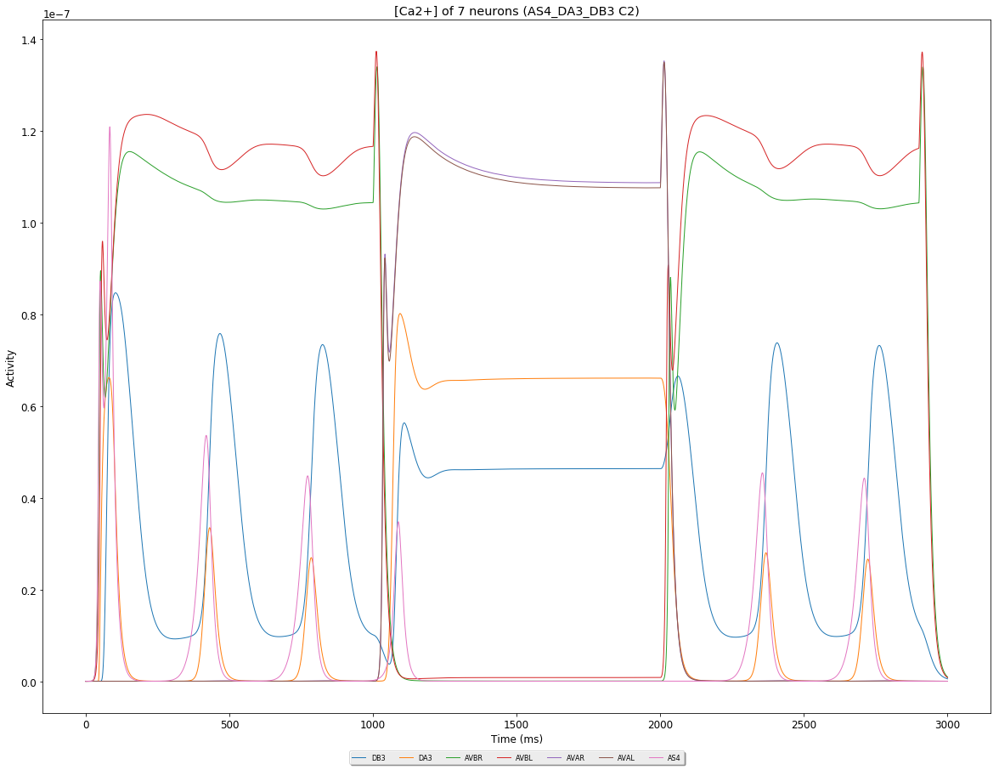
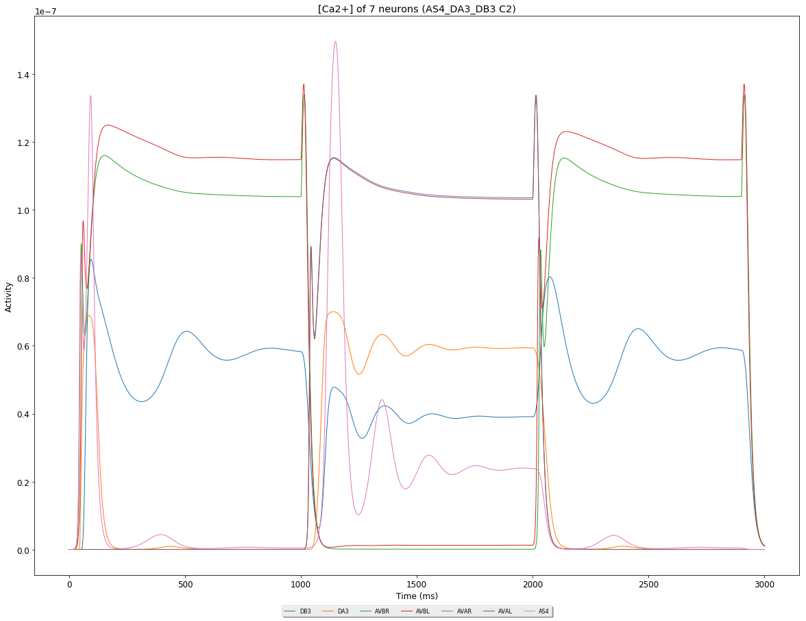
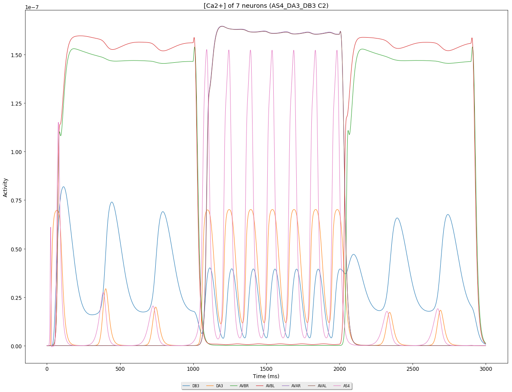
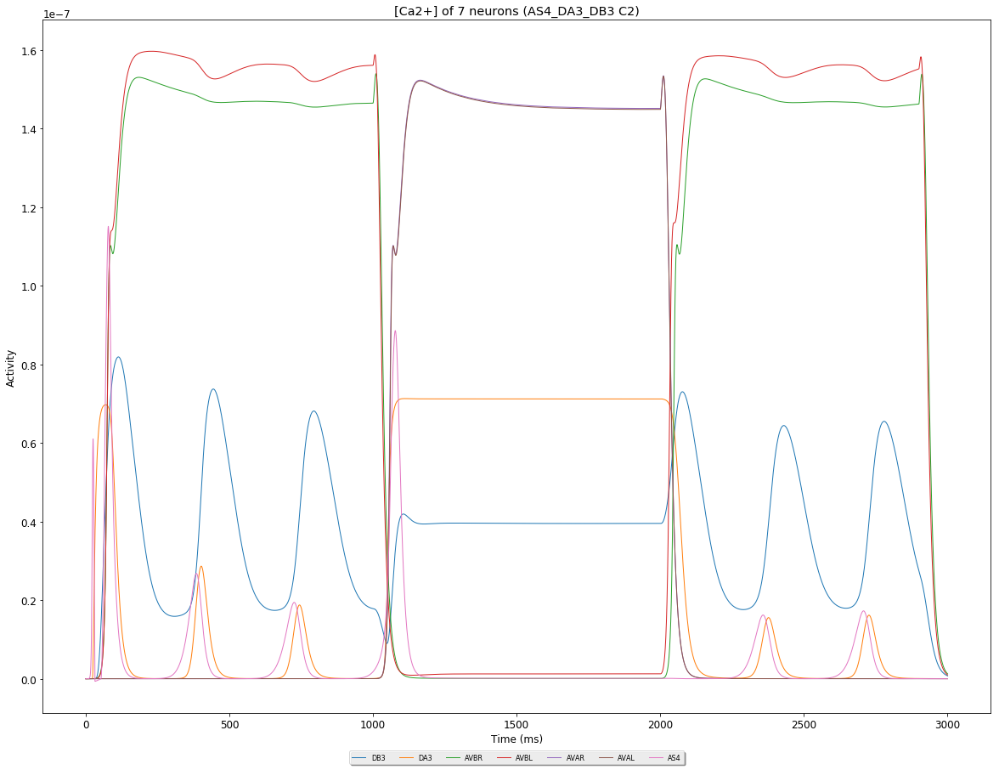
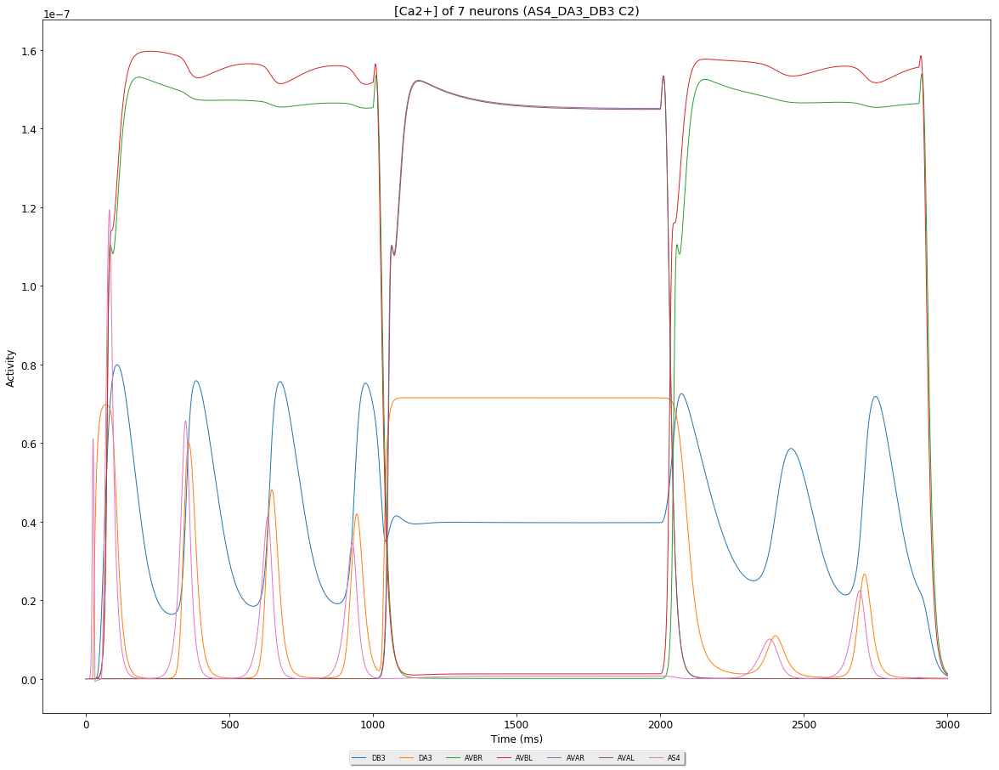

| Id | Neurons (membrane) | Neurons (membrane) | Muscles (membrane) | Muscles (membrane) | Neurons (activity) | Neurons (activity) | Muscles (activity) | Muscles (activity) |
| :---         |     :---:      |     :---:     |     :---:     |     :---:     |     :---:     |     :---:     |     :---:     |     :---:     |
| [case90](AS4-DA3-DB3_case90) |  |  | | |  |  | |
| [case89](AS4-DA3-DB3_case89) |  |  | | |  |  | |
| [case88](AS4-DA3-DB3_case88) |  |  | | |  |  | |
| [case87](AS4-DA3-DB3_case87) |  |  | | |  |  | |
| [case86](AS4-DA3-DB3_case86) |  |  | | |  |  | |
| [case85](AS4-DA3-DB3_case85) |  |  | | |  |  | |
| [case84](AS4-DA3-DB3_case84) |  |  | | |  |  | |
| [case83](AS4-DA3-DB3_case83) |  |  | | |  |  | |
| [case82](AS4-DA3-DB3_case82) |  |  | | |  |  | |
| [case81](AS4-DA3-DB3_case81) |  |  | | |  |  | |
| [case80](AS4-DA3-DB3_case80) |  |  | | |  |  | |
| [case79](AS4-DA3-DB3_case79) |  |  | | |  |  | |
| [case78](AS4-DA3-DB3_case78) |  |  | | |  |  | |
| [case77](AS4-DA3-DB3_case77) |  |  | | |  |  | |
| [case76](AS4-DA3-DB3_case76) |  |  | | |  |  | |
| [case75](AS4-DA3-DB3_case75) |  |  | | |  |  | |
| [case74](AS4-DA3-DB3_case74) |  |  | | |  |  | |
| [case73](AS4-DA3-DB3_case73) |  |  | | |  |  | |
| [case72](AS4-DA3-DB3_case72) |  |  | | |  |  | |
| [case71](AS4-DA3-DB3_case71) |  |  | | |  |  | |
| [case70](AS4-DA3-DB3_case70) |  |  | | |  |  | |
| [case69](AS4-DA3-DB3_case69) |  |  | | |  |  | |
| [case68](AS4-DA3-DB3_case68) |  |  | | |  |  | |
| [case67](AS4-DA3-DB3_case67) |  |  | | |  |  | |
| [case66](AS4-DA3-DB3_case66) |  |  | | |  |  | |
| [case64](AS4-DA3-DB3_case64) |  |  | | |  |  | |
| [case63](AS4-DA3-DB3_case63) |  |  | | |  |  | |
| [case62](AS4-DA3-DB3_case62) |  |  | | |  |  | |
| [case61](AS4-DA3-DB3_case61) |  |  | | |  |  | |

